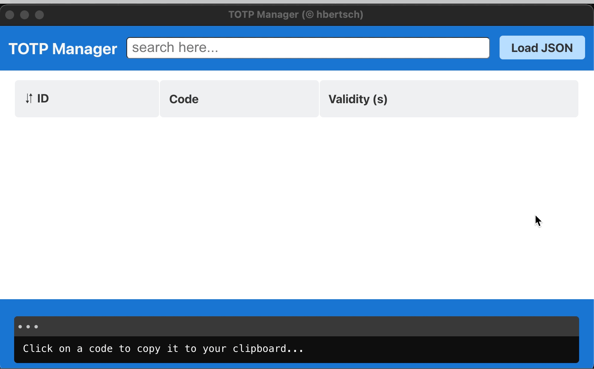

# TOTP Manager

`TOTP Manager` is a tool that let you manage your one time codes based on a `json` configuration file .

**The main features are:**

- **Loading** a collection of TOTP settings from file (`json`: see [example](#Example-Configuration-File))
- **Order** them by label (ascending / descending)
- **Search** for arbitrary string 
- Code is **copied to clipboard** on `left click` so you can paste it using `crtl+v` or `cmd+v`

## Latest Release

> Releases for **Linux** and **Windows** are **missing** and will be added later one (once if have time for that)

Check the [release section](https://github.com/hbertsch/totp-manager) to download the latest release.

## Quick Demo



## Example Configuration File

Use the codes provided by the TOTP setup dialogs (or extract them from the QR-Codes by scanning them) and save them in a `json`by using the following format (**example file** can be found in this repository under `resources/example-secrets.json`):

```json
[
    {
      "key": "ATDFYYP2NN6FYH3L",
      "label": "Microsoft.com"
    },
    {
      "key": "ATDFYYP2NN6FYH4L",
      "label": "GitHub.com"
    },
    {
      "key": "ATDFYYP2NN6FYH5L",
      "label": "Google.com"
    }
]
```

## Fundamentals

If you are interested in the fundamentals of how TOTP generation is working, check out [my other TOTP repository](https://github.com/hbertsch/simple-totp).
