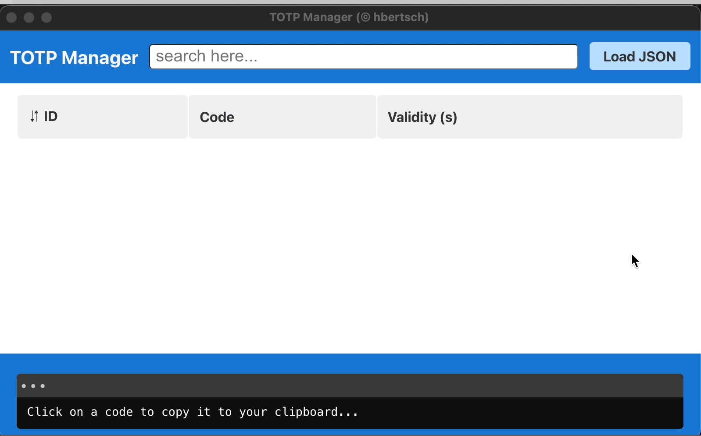

# TOTP Manager — Offline Desktop Authenticator App

[](LICENSE)
[](https://github.com/hbertsch/totp-manager/actions)

A free, open-source desktop authenticator for managing TOTP (Time-based One-Time Password) two-factor authentication codes. Works fully offline — your secrets never leave your machine. Available for macOS, Linux, and Windows.

Built with [Tauri 2](https://v2.tauri.app/) and vanilla JavaScript — no frameworks, no bloat, no telemetry.



## What is TOTP?

TOTP (Time-based One-Time Password) is the standard behind authenticator apps
like Google Authenticator or Authy. It generates a 6-digit code from a shared
secret key that changes every 30 seconds. TOTP Manager lets you store your
secret keys locally and view all your codes in one place.

## Features

- **Load** TOTP secrets from a JSON file
- **Sort** entries alphabetically (ascending / descending)
- **Search** for entries by label
- **Copy** codes to clipboard with a single click

## Platform Support

| Platform | Architecture | Status |
|----------|-------------|--------|
| macOS    | ARM64 (M1+) | Supported |
| macOS    | x64 (Intel) | Supported |
| Linux    | x64         | Supported |
| Windows  | x64         | Supported |

## Download

Check the [Releases](https://github.com/hbertsch/totp-manager/releases) page
for pre-built binaries.

> **macOS (unsigned build):** The app is not notarized, so macOS will block it
> on first launch. To open it:
> 1. Double-click the app — macOS will show a warning. Click **Fertig** / **Done**.
> 2. Go to **System Settings > Privacy & Security**, scroll down, and click
>    **Open Anyway** next to the TOTP Manager message.
> 3. Enter your password. The app will launch normally from now on.
>
> Alternatively, run `xattr -cr /Applications/TOTP\ Manager.app` in Terminal.

## Build from Source

### Prerequisites

```bash
# Install Rust (if not present)
curl --proto '=https' --tlsv1.2 -sSf https://sh.rustup.rs | sh

# Install Tauri CLI
cargo install tauri-cli --version "^2"
```

### Development (hot-reload)

```bash
cargo tauri dev
```

### Production build

```bash
cargo tauri build
# Output: src-tauri/target/release/bundle/macos/TOTP Manager.app
```

## Configuration

Use the codes provided by the TOTP setup dialogs (or extract them from the
QR codes by scanning them) and save them in a JSON file using the following
format (an example file can be found in this repository under
`resources/example-secrets.json`):

```json
[
  {
    "key": "ATDFYYP2NN6FYH3L",
    "label": "Microsoft.com"
  },
  {
    "key": "ATDFYYP2NN6FYH4L",
    "label": "GitHub.com"
  },
  {
    "key": "ATDFYYP2NN6FYH5L",
    "label": "Google.com"
  }
]
```

Then click **Load JSON** in the app toolbar to import the file.

## Security

**Secret keys are stored in the browser's `localStorage` as plain text.**
This means:

- Secrets are stored locally on your machine only — nothing is sent over the network
- Any code running in the Tauri webview context could access them
- There is no encryption at rest

This is comparable to how browser-based authenticator extensions work.
For higher-security needs, consider a hardware token or a vault-backed solution.

If you discover a security vulnerability, please see [SECURITY.md](SECURITY.md).

## How It Works

The app uses the [Web Crypto API](https://developer.mozilla.org/en-US/docs/Web/API/Web_Crypto_API)
to compute HMAC-SHA1 signatures from your secret keys and the current time step,
following [RFC 6238](https://datatracker.ietf.org/doc/html/rfc6238). The resulting
6-digit codes refresh every 30 seconds.

For a standalone implementation of the TOTP algorithm, see
[simple-totp](https://github.com/hbertsch/simple-totp).

<details>
<summary>Migrating from the Electron version</summary>

The Tauri version stores config under a different origin. After upgrading,
click **Load JSON** once to re-import your secrets file — one-time step.

</details>

## License

This project is licensed under the [GNU General Public License v3.0](LICENSE).
